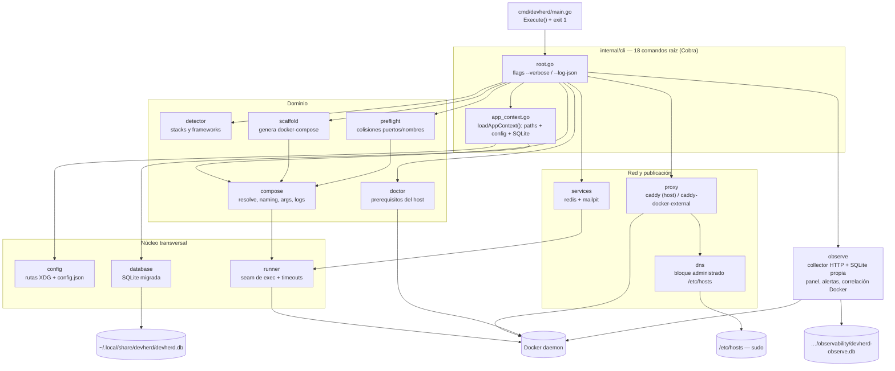
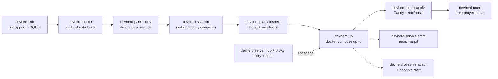
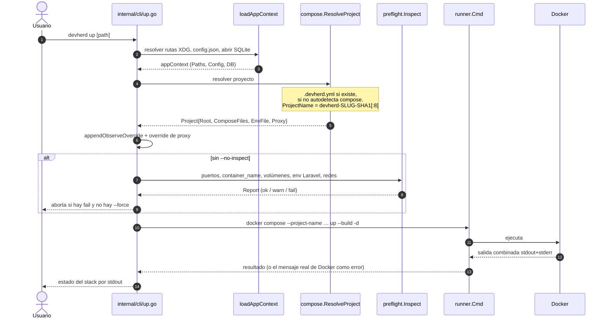
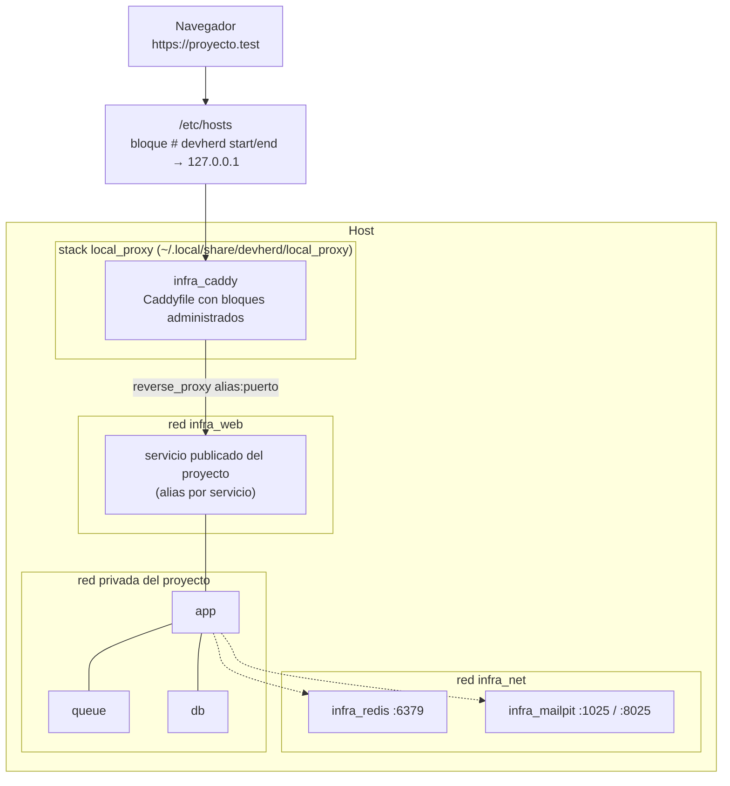
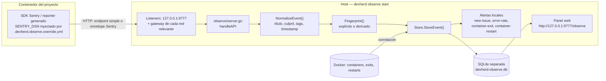
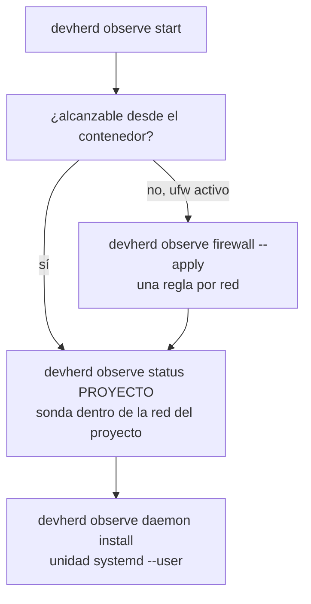
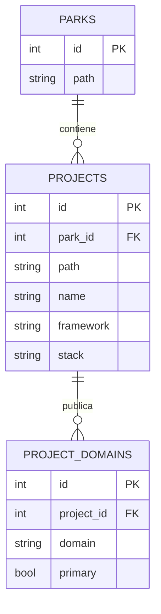
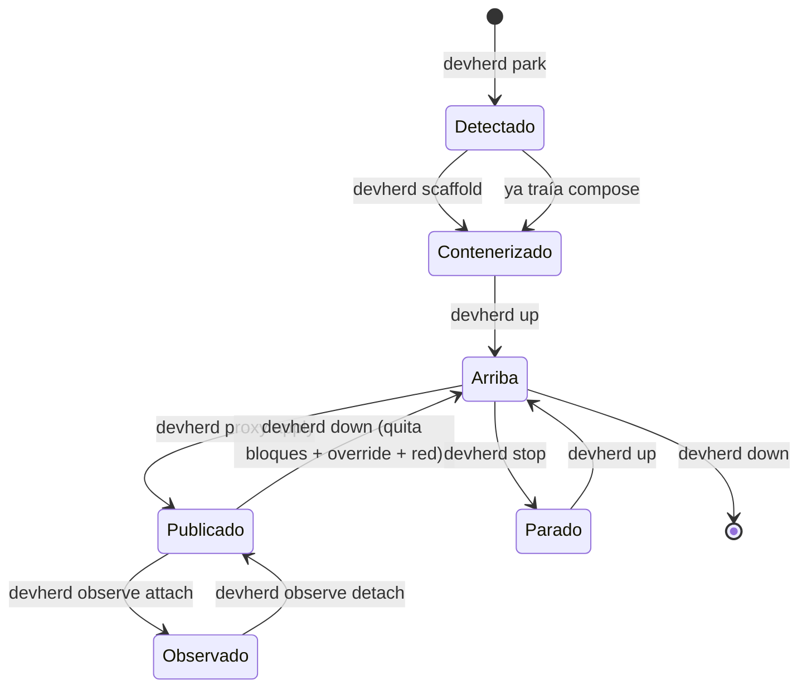

# Diagramas de DevHerd

Diagramas en [Mermaid](https://mermaid.js.org/), renderizables en GitHub, GoLand (plugin
Mermaid) y cualquier visor Markdown moderno. Complementan a
[ARCHITECTURE.md](ARCHITECTURE.md) (detalle de paquetes) y
[SYSTEM-OVERVIEW.md](SYSTEM-OVERVIEW.md) (estado real del sistema).

---

## 1. Arquitectura de componentes

Qué paquete depende de qué, y contra qué recurso externo actúa cada uno.



> `internal/api`, `internal/logs`, `internal/runtimes` e `internal/sentry` son sólo
> `doc.go` sin implementación; no aparecen en el diagrama a propósito.

---

## 2. Flujo típico de usuario



---

## 3. `devherd up` paso a paso



---

## 4. Proxy: driver `caddy-docker-external`

El camino recomendado. DevHerd administra un stack propio (`local_proxy`) cuyo
contenedor es `infra_caddy`.



Secuencia de `devherd proxy apply` con este driver:

```mermaid
sequenceDiagram
    autonumber
    participant CLI as cli/proxy.go
    participant EXT as proxy/external.go
    participant BS as proxy/bootstrap.go
    participant D as Docker
    participant DNS as dns.SyncHosts

    CLI->>EXT: BuildExternalProject(cfg, project)
    Note over EXT: dominio efectivo + prefijo de alias.<br/>Usa proxy.service/proxy.port del manifiesto;<br/>si no, regla especial vue+flask
    CLI->>EXT: EnsureComposeOverride
    Note over EXT: escribe .devherd.proxy.override.yml<br/>conectando servicios a infra_web
    CLI->>EXT: ConnectProject
    EXT->>D: crea red si falta + docker network connect --alias
    CLI->>EXT: ApplyExternalProxy
    EXT->>BS: BootstrapExternalProxy (plantillas go:embed)
    BS-->>EXT: compose.yml, Caddyfile, .env en local_proxy
    EXT->>EXT: mergeExternalProxyConfig (bloques administrados)
    EXT->>D: docker compose up -d
    EXT->>D: exec infra_caddy: caddy validate && caddy reload
    CLI->>DNS: syncManagedDomains
    DNS->>DNS: sudo cp del /etc/hosts con el bloque reescrito
```

> Fricción conocida: el Caddyfile se escribe **antes** de validarse y no hay rollback
> si la validación falla (`ARCHITECTURE.md` §17).

---

## 5. Observe: ingesta de eventos



El detalle que suele morder: dentro de un contenedor `127.0.0.1` es el propio
contenedor. Por eso el collector escucha también en los gateways de `infra_web`,
`infra_net` y las redes de los contenedores ya observados, y `attach`/`dsn` eligen la
red DevHerd con mayor cobertura de contenedores del proyecto.



---

## 6. Modelo de datos

Dos bases SQLite independientes, con dos sistemas de esquema distintos.



> La baseline `0001_init.sql` declara además `settings`, `runtime_preferences`,
> `services`, `sentry_configs` y `events`, pero **ningún código Go las usa** hoy.
> La base de Observe (issues, eventos, contenedores, alertas, deliveries) vive aparte
> y **no tiene migraciones versionadas**: reejecuta `schema.sql` en cada invocación.

---

## 7. Estados de un proyecto



---

## Cómo regenerar / editar

- Estos diagramas son **texto**: se editan aquí y se versionan con el código.
- Para exportar PNG/SVG: [mermaid.live](https://mermaid.live) o
  `npx @mermaid-js/mermaid-cli -i docs/diagrams.md -o out.png`.
- El grafo navegable autogenerado del repo está en `graphify-out/graph.html`
  (703 nodos, 45 comunidades) y su índice en `graphify-out/wiki/index.md`.
